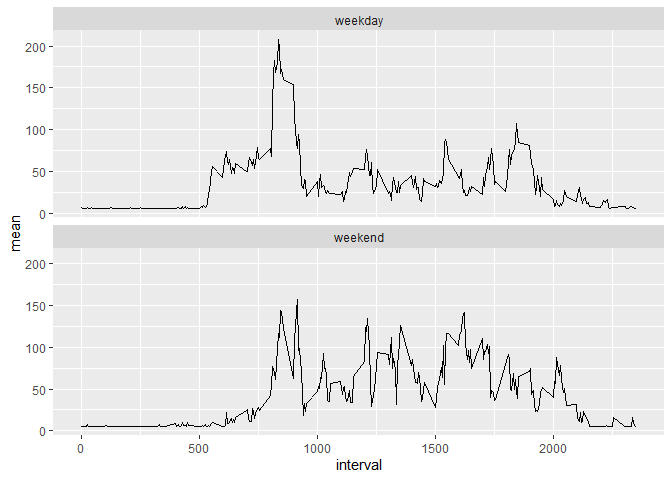

## Loading and preprocessing the data


```r
url<-"https://d396qusza40orc.cloudfront.net/repdata%2Fdata%2Factivity.zip"
download.file(url,destfile = ".//activity.zip")

zipF<- ".//activity.zip"
outDir<-".//activity"
unzip(zipF,exdir=outDir)

data<- read.csv(".//activity//activity.csv")

data$date<-as.Date(data$date, format = "%Y-%m-%d")
```


## What is mean total number of steps taken per day?

### Histogram of total number of steps taken each day


```r
steps_per_day<- data %>% 
        group_by(date) %>% 
                summarize(steps = sum(steps))

hist(steps_per_day$steps, ylim=c(0,40))
```

<!-- -->

### Mean and median total number of steps taken per day


```r
mean(steps_per_day$steps, na.rm=TRUE)
```

```
## [1] 10766.19
```

```r
median(steps_per_day$steps, na.rm=TRUE)
```

```
## [1] 10765
```


## What is the average daily activity pattern?


### Average number of steps per 5-min interval


```r
mean_per_interval<- data %>%
        group_by(interval) %>%
                summarize(mean= mean(steps, na.rm=TRUE))

plot(mean_per_interval$interval, mean_per_interval$mean, type ="l", 
     ylab="Average number of steps", xlab="5-min interval", main= "Average daily activity pattern" )
```

<!-- -->

### Which 5-minute interval, on average across all the days in the dataset, contains the maximum number of steps?


```r
mean_per_interval[which.max(mean_per_interval$mean),]
```

```
## # A tibble: 1 x 2
##   interval  mean
##      <int> <dbl>
## 1      835  206.
```

## Imputing missing values


### Total number of missing values in the dataset


```r
colSums(is.na(data))
```

```
##    steps     date interval 
##     2304        0        0
```
### Impute missing data and create new data set without missing values

Replace missing values by average number of steps: 


```r
mean(data$steps, na.rm=TRUE) 
```

```
## [1] 37.3826
```


```r
data_new<-data
data_new$steps[is.na(data$steps)]<-mean(data$steps, na.rm=TRUE)

colSums(is.na(data_new))
```

```
##    steps     date interval 
##        0        0        0
```

### Histogram of total number of steps taken each day of the new dataset

Compare histogram bevor and after imputing:


```r
steps_per_day_new<- data_new %>% 
        group_by(date) %>% 
                summarize(steps = sum(steps))
par(mfrow=c(1,2))
hist(steps_per_day$steps, ylim=c(0,40), main="original data")
hist(steps_per_day_new$steps, ylim=c(0,40), main="impute NA by mean(steps)")
```

<!-- -->

The histogram has changed. There are absolute more obvervations in the middle of the distribution where the mean ist located.  

### Compare estimates of mean and median number of steps per day

Before imputing:


```r
mean(steps_per_day$steps, na.rm=TRUE)
```

```
## [1] 10766.19
```

```r
median(steps_per_day$steps, na.rm=TRUE)
```

```
## [1] 10765
```

After imputing:


```r
mean(steps_per_day_new$steps)
```

```
## [1] 10766.19
```

```r
median(steps_per_day_new$steps)
```

```
## [1] 10766.19
```

The estimate of the mean does not change which seems logical because the missing values are replaced by the mean. The median changes slightly because now there are more values higher than the original median in the data set.

## Are there differences in activity patterns between weekdays and weekends?


### Create a new factor variable called weekday


```r
weekday<-vector(length=length(data_new))

data_new<-cbind(data_new,weekday)

data_new[weekdays(data_new$date) == "Samstag" | weekdays(data_new$date) == "Sonntag",]$weekday <- "weekend"
data_new[weekdays(data_new$date) != "Samstag" & weekdays(data_new$date) != "Sonntag",]$weekday <- "weekday"

mean_per_interval_new<- data_new %>%
        group_by(weekday,interval) %>%
        summarize(mean= mean(steps, na.rm=TRUE))
```

### Plot average number of steps per interval for weekday and weekend days


```r
p<-ggplot(mean_per_interval_new,aes(x=interval, y=mean))
p+geom_line()+
        facet_wrap(~weekday,ncol=1)
```

<!-- -->

